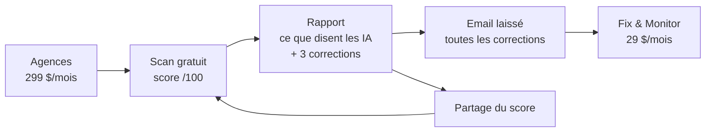

# Agent-Ready — Le projet dans sa globalité

*Version du 28 septembre 2026. Ce document rassemble tout ce qui a été décidé, construit et prévu. Les détails sont dans les documents cités à chaque section.*

---

## 1. En une phrase

**Agent-Ready aide les commerces de service (salons d'abord) à être recommandés et réservés par les assistants IA comme ChatGPT, Gemini et Perplexity.** On leur donne un score gratuit sur 100, puis on corrige leur site à leur place contre un abonnement.

---

## 2. Le problème

- De plus en plus de gens demandent à une IA plutôt qu'à Google : « le meilleur balayage près de chez moi, réservable ce soir ».
- L'IA ne recommande que ce qu'elle **comprend** : services, prix, horaires, lien de réservation.
- La plupart des sites de salons sont illisibles pour une IA :
  - prix publiés en photo ;
  - pas de lien de réservation exploitable ;
  - robots d'IA bloqués sans le savoir.
- Conséquence : le salon perd des clients **sans même le savoir**.

## 3. Pourquoi maintenant

| Signal | Date | Ce que ça veut dire |
|---|---|---|
| Shopify ouvre ses 5,6 M de boutiques aux agents IA | Mars 2026 | Le commerce en ligne est équipé, **les commerces de service sont les suivants** |
| OpenAI ferme l'achat direct dans ChatGPT | Mars 2026 | Le modèle devient « trouvé via l'IA, réservé chez le commerçant » |
| Visa et Mastercard lancent les paiements par agents | Juin–juillet 2026 | L'infrastructure arrive |
| Cloudflare bloque les robots d'IA par défaut | Septembre 2026 | Beaucoup de sites deviennent invisibles aux IA sans le savoir |
| Réservation par agents à grande échelle | Attendue 2027–2028 | Les commerces équipés avant seront devant |

**La fenêtre estimée :** 12 à 18 mois avant que Google, Wix ou les plateformes de réservation ne le fassent eux-mêmes. *(Estimation, pas un chiffre sourcé.)*

---

## 4. Le produit

| Brique | Ce qu'elle fait | Prix | État |
|---|---|---|---|
| **Scan gratuit** | 12 vérifications du site + interrogation de ChatGPT, Gemini, Perplexity → score sur 100, note A–F, verdict en une phrase | Gratuit | ✅ Construit (IA : attend les clés) |
| **Rapport** | Ce que chaque IA dit du salon, sous-scores (Autorisé, Compris, Réservable, Prêt pour l'IA), corrections classées par impact | Gratuit (3 corrections), email pour le reste | ✅ Construit |
| **Générateur de corrections** | À partir des horaires, prestations et lien de réservation → fiche entreprise pour les IA (JSON-LD), page résumé (`llms.txt`), lignes `robots.txt`, avec instructions Wix / Squarespace / WordPress | Inclus dans l'offre payante | ✅ Construit |
| **Fix & Monitor** | Corrections hébergées et tenues à jour, nouveau scan mensuel, alertes quand une IA se trompe, mesure des clients venus des IA | 29 $/mois par établissement | 🔜 Paiement et hébergement des corrections à construire |
| **Offre agences** | Scans illimités, rapports à leur marque, scan d'une ville entière, corrections pour 25 établissements | 299 $/mois | 🔜 À construire |
| **Carte de score / classements** | Image à partager, classement des meilleurs salons par ville | Gratuit (viralité) | ✅ Carte · 🔜 Classements publics |

Détails : `agent-ready/METHODOLOGY.md`, `agent-ready/README.md`.

---

## 5. Les clients

| Client | Qui | Ce qu'il veut | Ce qu'il paie |
|---|---|---|---|
| **Salon indépendant** (cible n°1) | Gérant·e de salon de coiffure, institut, barbier, aux États-Unis | Plus de clients, sans devenir technicien | 29 $/mois |
| **Agence web / marketing locale** (levier n°1) | Agences de 5 à 50 personnes qui font les sites des commerces locaux | Un nouveau service à vendre, une raison d'appeler chaque client | 299 $/mois |
| Métiers suivants (mois 4+) | Spas, ongleries, esthétique, cliniques dentaires | Même besoin | Même offre |

---

## 6. Comment on trouve les clients

| Canal | Principe | Détail |
|---|---|---|
| **Email personnalisé** | Chaque salon reçoit **son propre score** et le lien vers son rapport | 3 emails sur 8 jours · `campaign/sequence-salons.md` |
| **Agences** | On scanne un client de leur portefeuille et on leur envoie son score | 3 emails + LinkedIn · `campaign/sequence-agencies.md` |
| **Contenu par ville** | « X % des salons d'Austin ne peuvent pas être réservés par une IA » + top 10 | LinkedIn, X, Reddit, presse locale · `campaign/content-city-launch.md` |
| **Partage** | Les salons bien notés partagent leur score | Carte de score, classements |

**Pays :** États-Unis d'abord (prospection B2B autorisée avec désinscription). Canada et Australie après validation juridique. Royaume-Uni et Union européenne uniquement via les agences.

La chaîne est automatisée : liste Google → scan → rapport → email de contact → fichier pour l'outil d'envoi. Plan complet : `agent-ready/campaign/PLAN.md`.

---

## 7. Concurrence et différence

| Acteur | Ce qu'il fait | Notre différence |
|---|---|---|
| Outils de visibilité IA (Profound, Peec…) | **Mesurent** la visibilité des marques dans les IA, pour les équipes marketing | On **corrige** pour le commerçant, en un clic, à 29 $ |
| Outils de référencement local (Yext, BrightLocal) | Fiches Google, avis | Pas centrés sur la lisibilité et la réservation par les IA |
| Plateformes de réservation (Fresha, Booksy, Vagaro) | Réservation | **Menace n°1** : elles pourraient rendre tous leurs salons lisibles d'un coup. Parade : devenir leur partenaire, viser les salons avec site propre, et les agences |
| Wix, Squarespace, GoDaddy | Sites | Pas de produit dédié identifié. Ce sont aussi des **acheteurs potentiels** |

---

## 8. Technologie

| Élément | Choix | Pourquoi |
|---|---|---|
| Serveur | Node.js sans framework | Démarre en une commande, se maintient seul, hébergement ~20 $/mois |
| Stockage | Fichiers (test) → base de données (PostgreSQL / Supabase) avant le volume | Simple d'abord |
| Analyse des sites | Code maison (données structurées, robots.txt, llms.txt, 30+ plateformes de réservation) | Contrôle total du score |
| IA | API OpenAI, Gemini, Perplexity | Les trois IA que les clients utilisent |
| Interface | HTML/CSS/JS + three.js (orbe 3D) | Rapide, mobile, pas de compilation |
| Prospection | Google Places API + export CSV vers Instantly / Smartlead / lemlist | Automatisé |
| Qualité | 14 tests automatiques, vérification dans un vrai navigateur | Tous au vert |

Code : dossier `agent-ready/`. Aperçu en ligne (privé) : https://claude.ai/artifact/21msDqQKPrLDA8Uw41ybcV

---

## 9. Qui fait quoi

| Rôle | Qui | Responsabilités |
|---|---|---|
| Fondatrice / fondateur | Toi | Vente, agences, partenariats, marque, décisions, société, budget |
| Produit et technique | Claude (jusqu'aux premiers revenus) | Code, mise en ligne, campagne automatisée, analyses |
| Juridique | Avocat (à l'acte) | Règles d'envoi, CGU, confidentialité, données Google |
| Mois 6–9 | 1re recrue (vente/support) ou associé technique | Si le revenu le permet ; rassure un acheteur |

---

## 10. Feuille de route et décisions

| Période | Objectif | Décision |
|---|---|---|
| **Semaines 0–1** | 10 conversations (5 salons, 5 agences) · nom, domaines, société · hébergement, clés d'API · préchauffage des boîtes mail · calibrage sur 200 salons d'Austin | ≥ 3 salons sur 5 prêts à payer 29 $ ? Sinon priorité aux agences |
| **J14** | 500 salons + 100 agences contactés | ≥ 15 % ouvrent leur rapport et ≥ 5 agences intéressées ? |
| **J30** | Paiement ouvert, ~3 000 emails/semaine | ≥ 30 salons payants ou ≥ 3 agences ? |
| **Mois 2–3** | Offre agences, Stripe, base de données · 2 villes par semaine | **M3 : > 4 k$/mois → accélérer · < 2 k$/mois → pivot agences** |
| **Mois 4–6** | Classements et badges, 2e métier, partenariats plateformes de réservation | |
| **Mois 6–9** | 1re recrue, automatisation des corrections hébergées | **M9 : vendre, continuer seule ou lever des fonds** |
| **Mois 12–24** | Croissance, nouveaux pays via agences | Vente visée à 18–24 mois |

---

## 11. Les chiffres

**Budget :** ~5 à 10 k$ sur les 6 premiers mois ; ~500 à 1 500 $/mois de campagne en régime de croisière. *(Estimations.)*

**Projection du revenu mensuel récurrent** (hypothèses : 29 $/salon, 299 $/agence, 3 à 6 % de clients perdus par mois) :

| Scénario | M3 | M6 | M12 | M18 |
|---|---|---|---|---|
| Prudent | 1 k$ | 2,7 k$ | 5 k$ | 7 k$ |
| **Médian** | **4 k$** | **11 k$** | **26 k$** | **46 k$** |
| Ambitieux | 11 k$ | 31 k$ | 98 k$ | 260 k$ |

**Valorisation possible** *(ordres de grandeur, à valider avec un courtier)* :

| Moment | Situation | Valeur |
|---|---|---|
| 3–6 mois sans traction | Code + marque | 5–30 k$ |
| 9–12 mois | 5–15 k$/mois, rentable | ~200–900 k$ |
| **18–24 mois, médian** | 300–550 k$/an | **~1,5–4 M$** |
| 18–24 mois, ambitieux | 1–3 M$/an, forte croissance | ~10–30 M$ (rachat stratégique) |

**Acheteurs possibles :** Wix, GoDaddy, Squarespace, Yelp, Fresha, Booksy, Mindbody, Yext, BrightLocal, Semrush.

---

## 12. Risques et parades

| Risque | Probabilité | Parade |
|---|---|---|
| Les plateformes de réservation rendent leurs salons lisibles par les IA | Moyenne–forte | Partenariat avec elles, cible salons avec site propre, offre agences |
| Les salons ne ressentent pas encore la douleur | Moyenne | Validation par 10 conversations avant tout envoi ; bascule vers les agences |
| Google ou Wix intègrent la fonction | Moyenne | Aller vite, posséder les agences et les données (ils deviennent acheteurs) |
| Score instable (les IA varient) | Forte | Méthode publique, score présenté comme estimation datée, moyenne sur plusieurs requêtes |
| Délivrabilité des emails | Moyenne | Domaines séparés, préchauffage, volumes modérés, désinscription immédiate |
| Juridique (emails, données Google) | Faible si encadré | Avocat avant lancement ; États-Unis d'abord |

---

## 13. Où on en est

**Fait ✅**
- Recherches : marché, besoins à venir, concurrence, design (`docs/`, `research_notes/`, `reports/`)
- Site complet en anglais avec orbe 3D, rapport, générateur de corrections, pages méthodologie / CGU / confidentialité (brouillons)
- Moteur de scan et de score, rapports partageables, suivi des événements
- Chaîne de prospection automatisée, séquences d'emails salons et agences, scripts d'entretien, contenus par ville, tableau de suivi
- Aperçu en ligne privé

**À faire 🔜**
| Qui | Action |
|---|---|
| Toi | 10 conversations de validation |
| Toi | Nom + domaines + société |
| Toi | Clés d'API dans l'environnement : `OPENAI_API_KEY`, `GEMINI_API_KEY`, `PERPLEXITY_API_KEY`, `GOOGLE_PLACES_API_KEY`, `BASE_URL` |
| Toi | Boîtes mail d'envoi + préchauffage (2–3 semaines) |
| Toi + avocat | Validation juridique |
| Claude | Mise en ligne + calibrage sur 200 salons |
| Claude | Offre agences (marque blanche, scan groupé) |
| Claude | Paiement Stripe + base de données |

---

## 14. Petit glossaire

| Terme | Explication simple |
|---|---|
| **Agent IA** | Un assistant (ChatGPT, Gemini…) qui ne se contente pas de répondre mais agit : cherche, compare, réserve |
| **JSON-LD / schema.org** | Une « carte de visite » invisible sur le site, que les IA lisent : nom, adresse, horaires, prix, lien de réservation |
| **llms.txt** | Une page texte écrite pour les IA qui résume le commerce : le menu, pour les robots |
| **robots.txt** | Le fichier qui dit aux robots ce qu'ils ont le droit de lire. Beaucoup de sites bloquent les IA par défaut |
| **MRR / revenu mensuel récurrent** | Ce que rapportent les abonnements chaque mois |
| **Préchauffage** | Envoyer progressivement plus d'emails depuis une nouvelle boîte pour ne pas finir en spam |
| **Marque blanche** | L'agence revend notre produit sous sa propre marque |
